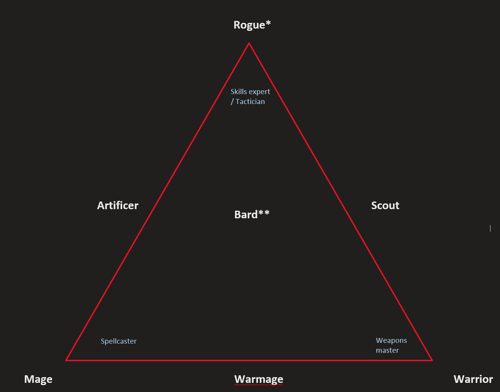

---

---

The main idea is to have classes balanced around a triangle with 3 major points:

<ul>
<li>Spellcasting</li>
<li>Abilities experts</li>
<li>Weapon fighting</li>
</ul>

Most of the class abilities will come from the <strong>subclass</strong>, while a few abilities will be inherited from the class. Classes and subclasses describe game mechanics which can be explained and flavored according to the player’s desire (For example - the Beast Master subclass can either be a ranger who is connected to the forest and nature, an inventor who uses constructs in combat, or a shaman who summons spirits to fight for him).

The guiding principle is

<h2 id="warrior">Warrior</h2>

Heavily relies on <a href="Core_Combat_Mechanics/Focus%20and%20Stance.md">Stances</a> and <a href="Core_Combat_Mechanics/Stamina%20points">Stamina points</a>. A warrior mainly uses weapons &amp; armor to be a mighty foe in combat. They get Extra attacks and add 
Warrior subclasses in mind:

<ul>
<li>Battle Master</li>
<li>Barbarian</li>
<li>Cavalier</li>
</ul>
<h2 id="mage">Mage</h2>

Mages rely heavily on spellcasting in their adventuring career. Most mages will prefer to stay away from the front lines and support their party with buffs, crowd control and ranged powerful spells. Mages rely heavily on maintaining a Focus and managing their Spell Slots - which represents the magical energy the expend when casting powerful spells.

mage subclasses in mind:

<ul>
<li>I don’t know how I want to build this class</li>
</ul>
<h2 id="rogue">Rogue</h2>

Rogues are

