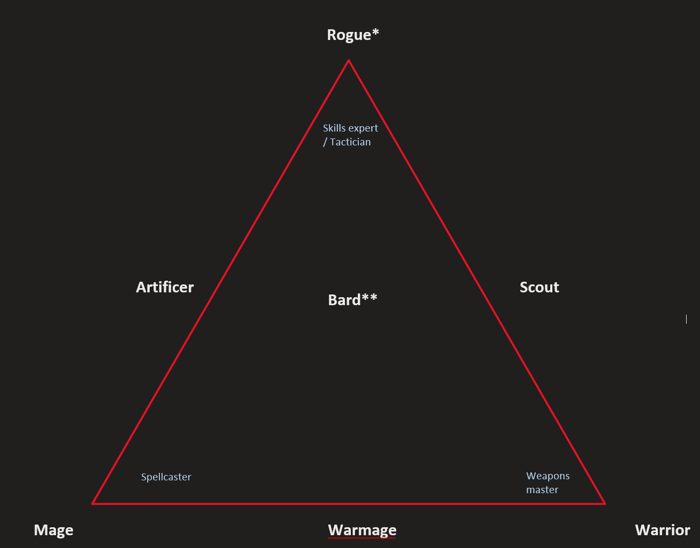

The main idea is to have classes balanced around a triangle with 3 major points:

*   Spellcasting
*   Abilities experts
*   Weapon fighting

Most of the class abilities will come from the **subclass**, while a few abilities will be inherited from the class. Classes and subclasses describe game mechanics which can be explained and flavored according to the player’s desire (For example - the Beast Master subclass can either be a ranger who is connected to the forest and nature, an inventor who uses constructs in combat, or a shaman who summons spirits to fight for him).

## Warrior

Heavily relies on [Stances](Core_Combat_Mechanics/Focus%20and%20Stance.md) and [Stamina points](Core_Combat_Mechanics/Stamina%20points). A warrior mainly uses weapons & armor to be a mighty foe in combat. They get Extra attacks and add  
Warrior subclasses in mind:

*   Battle Master
*   Barbarian
*   Cavalier

## Mage

Mages rely heavily on spellcasting in their adventuring career. Most mages will prefer to stay away from the front lines and support their party with buffs, crowd control and ranged powerful spells. Mages rely heavily on maintaining a Focus and managing their Spell Slots - which represents the magical energy the expend when casting powerful spells.

Mages are unique in that they don’t have any subclasses. Instead they are built with modules \[need to rename that\]. And they gain a few extra feats with which they can enhance their spellcasting.

## Rogue (not happy with this name)

Rogues Should rely on combat management, they can do a lot in the right circumstances, but otherwise they are limited during combat.  
They more than make up for it with out of combat utility and cunning.

## Warmage

Warmages are experts in combining armed combat with spellcasting. Depending on the subclass, warmages might use any combination of spell slots, stamina points, Focus and Stances.  
Their spellcasting will be similar to 5e sorcerer, albeit toned down.

Warmage subclasses in mind:

*   Cleric / Paladin (yeah, they are kinda the same)
*   Eldritch knight
*   Bladesinger

## Scout

Scouts are light on their feet and and provide a lot of utility to any adventuring group. Unlike the rogues, they are a bit more flexible, but still benefit from a careful set-up.  
Subclasses in mind:

*   Beast Master
*   Monster Hunter (=5e ranger without magic)
*   Swashbuckler

## Artificer (not happy with this name)

Artificer are masters of finding magical solutions to tough problems. They combine utility and magic. Like Mages, they choose their prepared spells on a daily basis. Their spells lack the offensive capabilities of Mages and Warmages, but they can aid their party members in combat, as well as outside of it. Unlike the Mage, their spell list is determined by their subclass.

Subclasses in mind:

*   Alchemist
*   Arcane Trickster
*   Loremaster

## Bard (also not happy with this name)

Bards are jacks of all trades. They provide utility, magic, as well as some martial prowess.  
They cast spells in a similar manner to the warmage (A short list of spells known, which they choose only when they level up).
